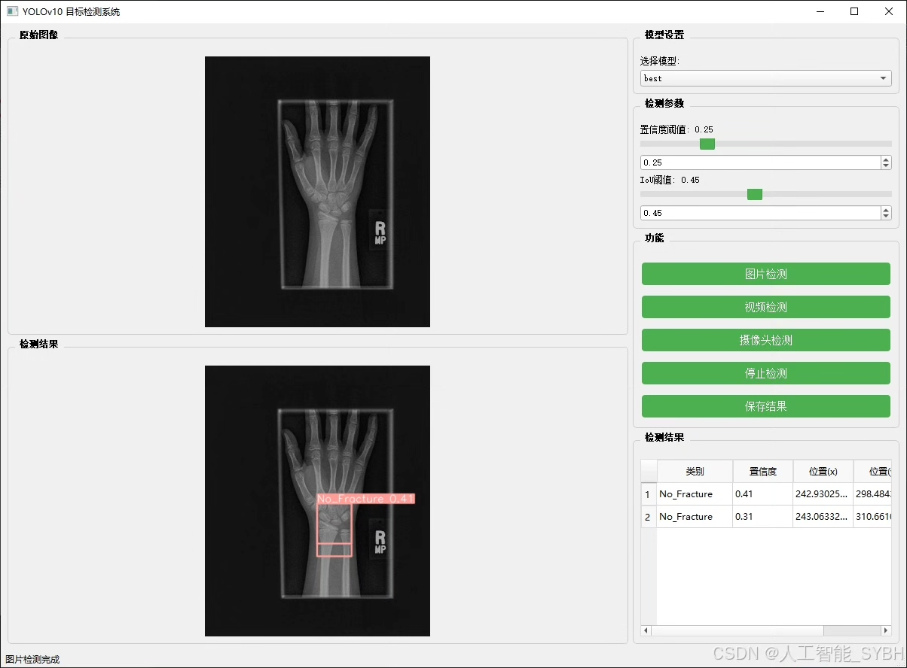
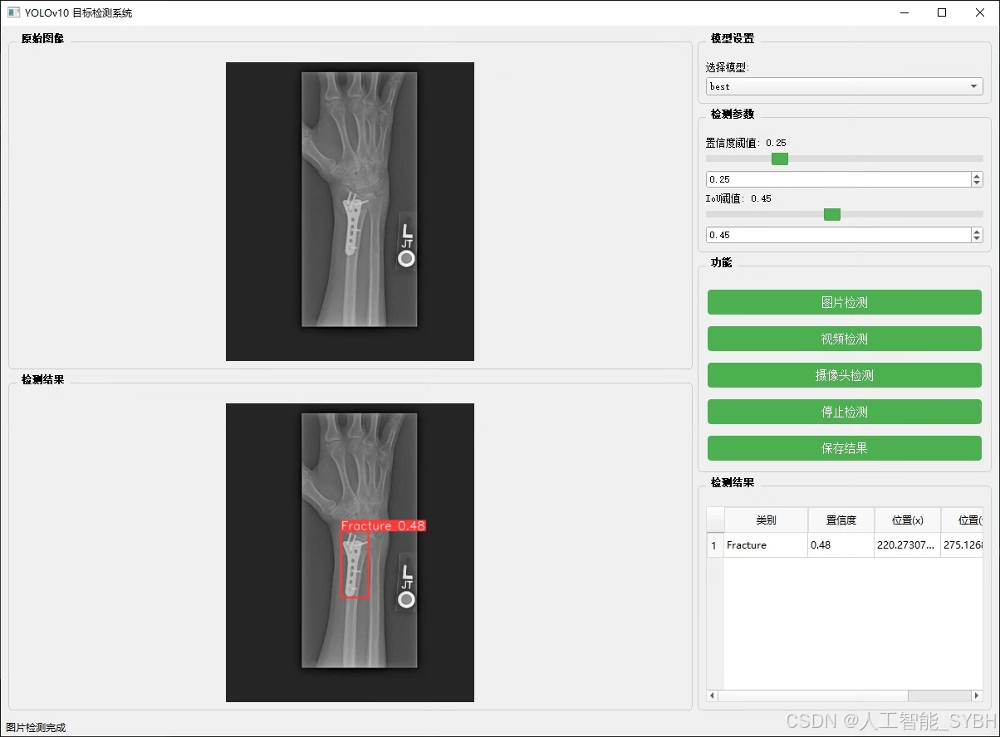
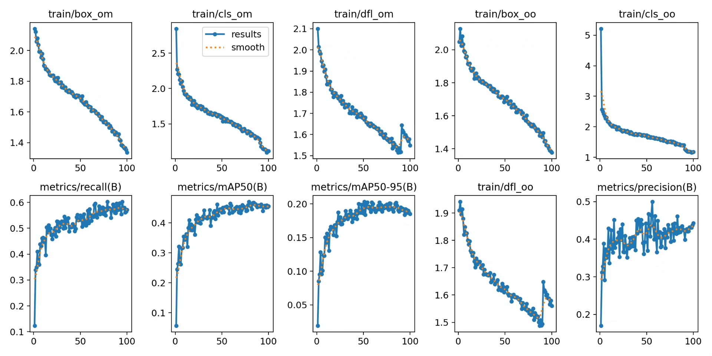
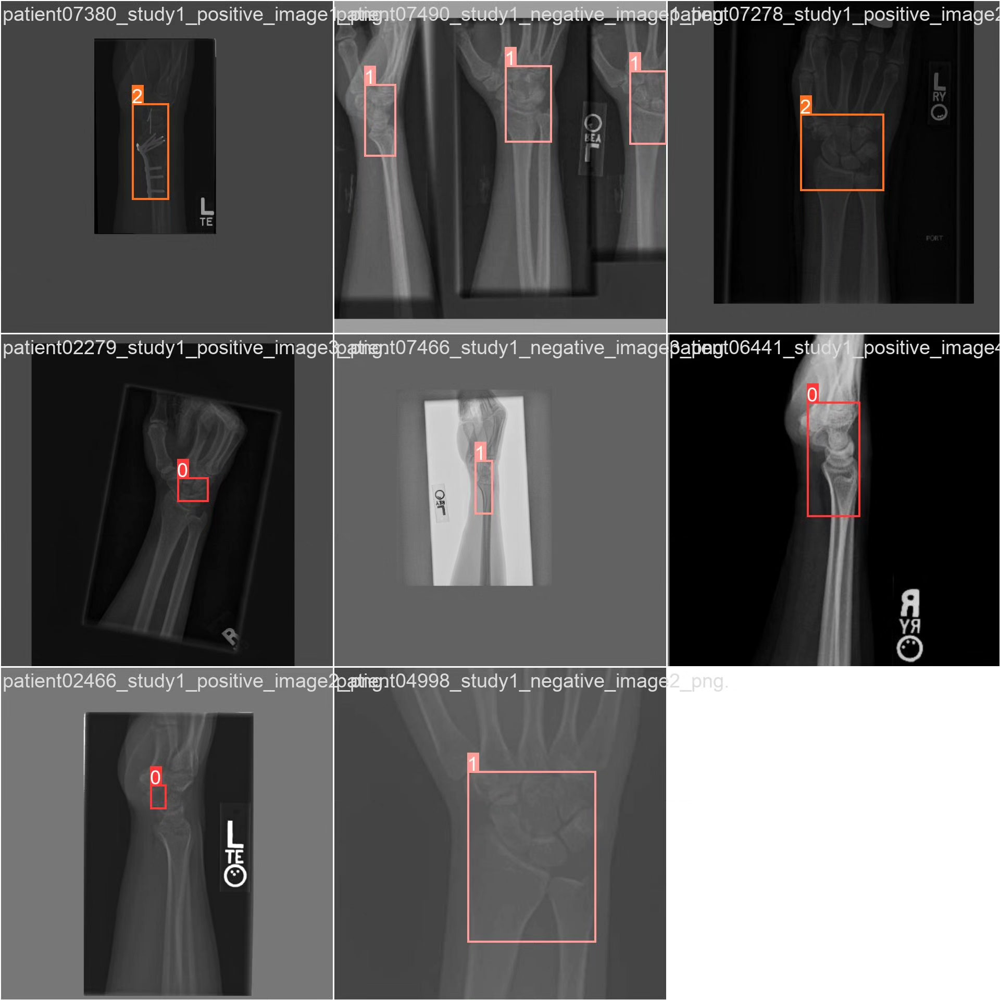
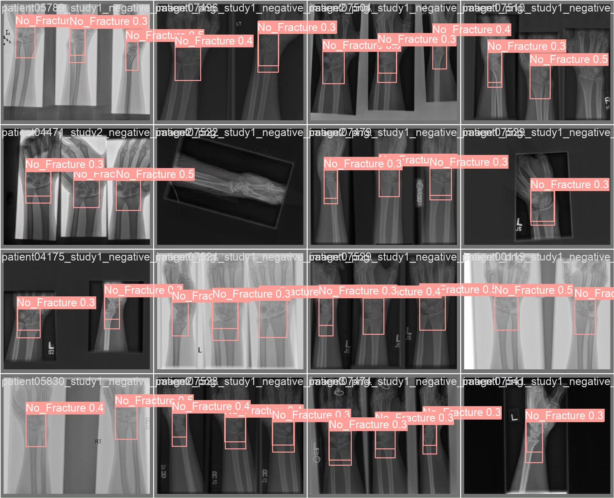
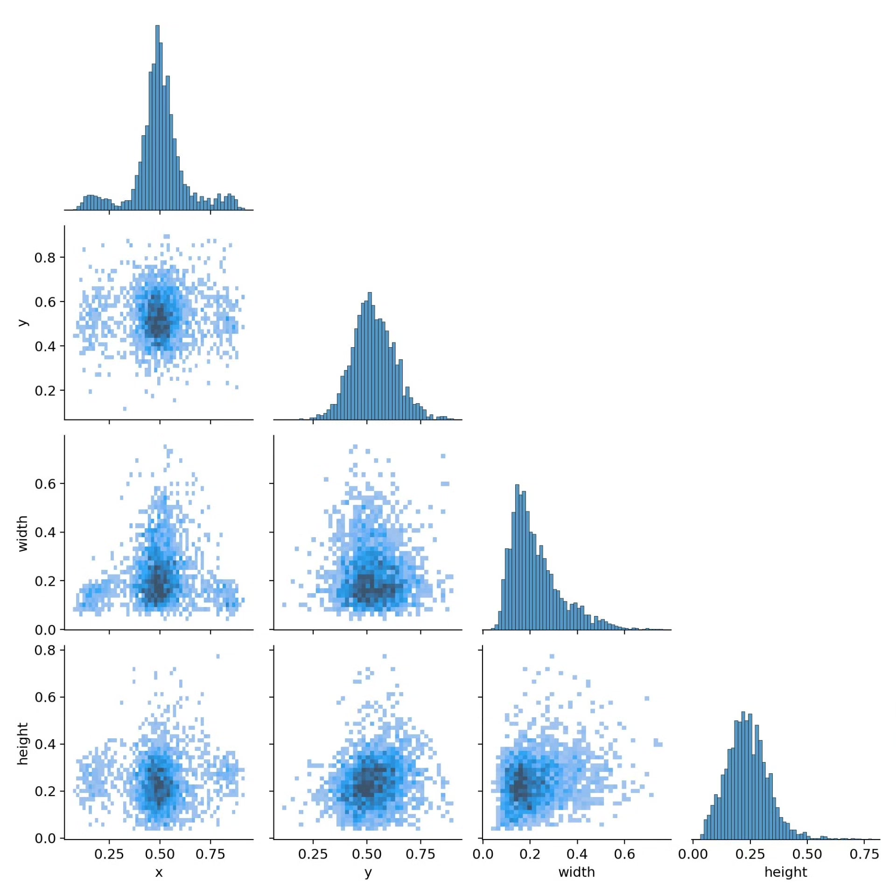
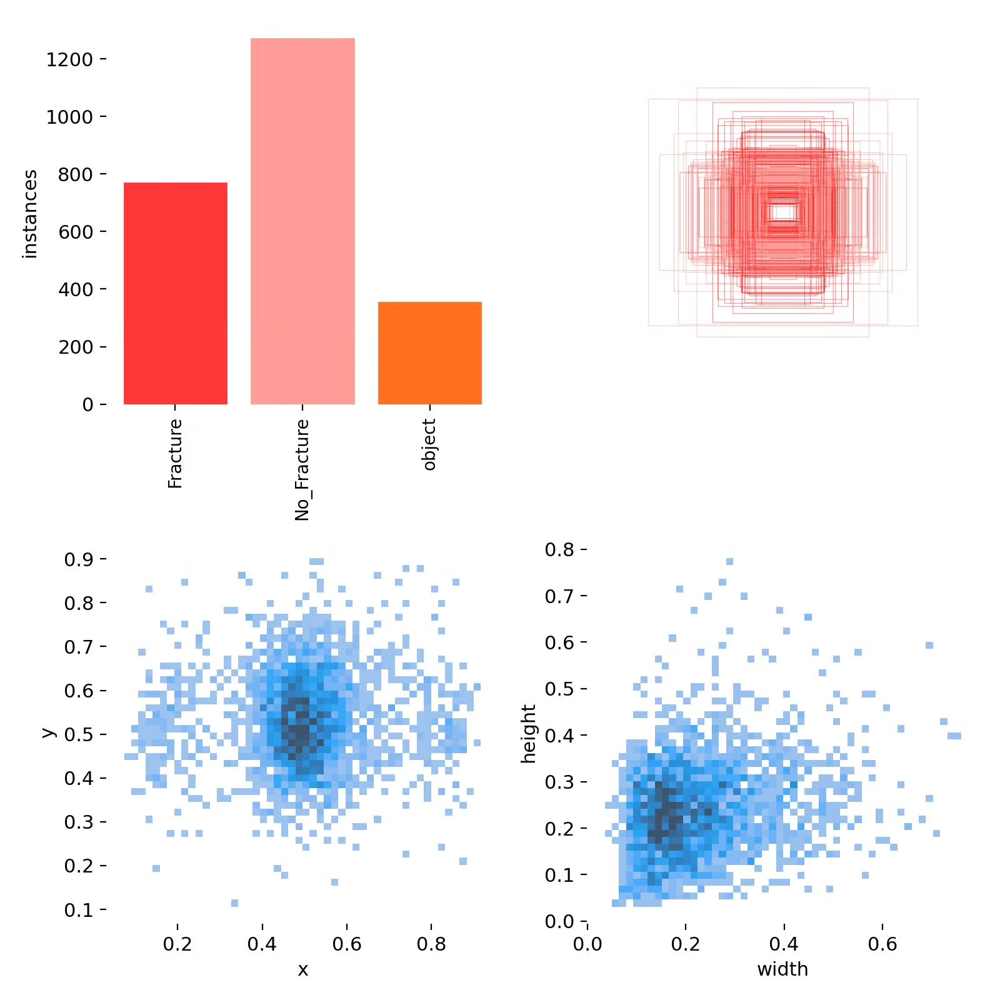

# Bone fracture detection system based on deep learning YOLOv10 (YOLOv10+Y)

## Body

This project aims to utilize the YOLOv10 (You Only Look Once version 10) object detection algorithm to develop an efficient fracture detection system. This system can automatically detect fracture areas in medical images and distinguish fracture types (such as Fracture, No_Fracture, object), providing a tool for assisting diagnosis for doctors.

The company's products have obtained the official commercial license certification of YOLO.

We provide after-sales service.

After payment, we will provide WeChat IDs, answering questions anytime.

Environment configuration: We will provide a tutorial on environment configuration, and WeChat will provide answers.

Remote installation service: If you need remote configuration, additional payment is required at 69, and all fees will be refunded if the configuration fails (specially for old computers only refund installation fees).

Retraining dataset: After configuring the environment, you can train on your own computer. If you need us to retrain, just pay 69 + computing power fees (2.5 yuan/hour).

Full after-sales service

## Images

## Payment

Here is a pay link on Stripe ( https://buy.stripe.com/3cs8yP7sY87d0vu9AB ). Please contact me lonlonago@foxmail.com after funding $89, and I will send you a complete data files , thank you!

